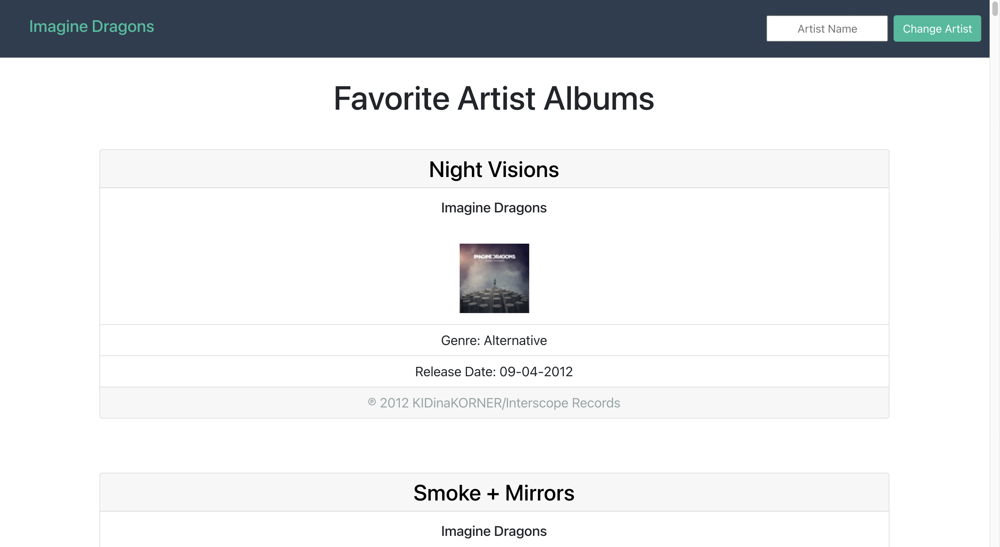

# Favorite artist albums app

### This is a very simple app for looking up the albums of artists you enjoy.

## Features

- Responsive
- Can change artists (form handling)
- Has some very simple error handling
- Doesn't look too bad
- Meets requirements
- Artist name in navbar & album titles link to apple music pages
- has working smoke tests 

## Running this app

(This assumes you have Node.js & npm installed, 
and have basic knowledge on the terminal / command line )

* click the green "Code" button on the top right
* copy the HTTPS link, or click the clipboard icon
* open the terminal to the directory you want to save the files to
* enter `git clone [paste HTTPS link here]
* cd into the directory and run `npm i` or `npm install` to install the depndencies
* use the other commands below

## Available Scripts

In the project directory, you can run:

### `npm start`

Runs the app in the development mode.\
Open [http://localhost:3000](http://localhost:3000) to view it in the browser.

The page will reload if you make edits.\
You will also see any lint errors in the console.

### `npm test`

Launches the test runner in the interactive watch mode.\
See the section about [running tests](https://facebook.github.io/create-react-app/docs/running-tests) for more information.

### `npm run build`

Builds the app for production to the `build` folder.\
It correctly bundles React in production mode and optimizes the build for the best performance.

The build is minified and the filenames include the hashes.\
Your app is ready to be deployed!

See the section about [deployment](https://facebook.github.io/create-react-app/docs/deployment) for more information.

## Learn More

## Getting Started with Create React App

This project was bootstrapped with [Create React App](https://github.com/facebook/create-react-app).